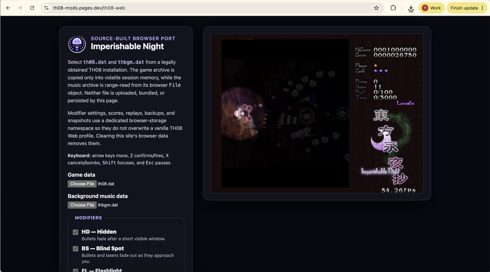

# Hi, I'm N0zoM1z0 👋

The name `N0zoM1z0` comes from Nozomi and Mizore in [*Liz and the Blue Bird*](https://liz-bluebird.com/), which is my favorite film. 

Most days, I do research at Tsinghua University, where I'm currently focused on formal verification and zero-knowledge systems. I also reconstruct Touhou games, and that work often turns into other experiments.

You can reach me on [X](https://x.com/r00tth3w0r1d) or my email [here](mailto:r00tth3w0r1d@gmail.com).

## 🛠️ What I'm Working On

- **Agentic reverse engineering / REA.** With [morluto](https://github.com/morluto), I co-build [REA](https://github.com/morluto/rea) , an agentic reverse-engineering system from app behavior down to native binaries. It recently crossed **10k stars** and hit **#1 on Trendshift Weekly**, which has been pretty wild to watch.
- **Formal verification.** My research applies formal verification to the security of network protocols such as DNS and BGP.
- **Zero knowledge and zkVMs.** With [Bera Buddies](https://github.com/berabuddies), I'm exploring domain-specific zkVMs and broader questions about how zkVMs are designed, including where compiler optimization fits in.
- **Agents and AI for math.** With [morluto](https://github.com/morluto), I'm exploring AI for math and building [Jacobian](https://github.com/morluto/jacobian), a set of mathematical tools that agents can use and combine. We recently put forward a [proposed complete solution to Erdős Problem 81](https://github.com/N0zoM1z0/erdos-81).
- **Touhou.** I'm reconstructing, porting, and modding Touhou games, and trying out ideas from formal methods, zero knowledge, and fuzzing along the way.

Most of my research is still unpublished, so the related repositories are private for now. That's why the public side of my GitHub is mostly Touhou: I'm a fan who can't help bringing my research habits to the games.

## ⛩️ Touhou Projects

- **Reconstruction, ports, and mods.** I'm reconstructing [TH03](https://github.com/N0zoM1z0/th03), [TH04](https://github.com/N0zoM1z0/th04), [TH07.5](https://github.com/N0zoM1z0/th075) , [TH08](https://github.com/N0zoM1z0/th08), [TH09](https://github.com/N0zoM1z0/th09), [TH09.5](https://github.com/N0zoM1z0/th095), [TH10](https://github.com/N0zoM1z0/th10), [TH10.5](https://github.com/N0zoM1z0/th105), and [TH20](https://github.com/N0zoM1z0/th20). [TH08 Web](https://github.com/N0zoM1z0/th08-web) brings Imperishable Night to the browser with your own retail game files; [TH08 Mods](https://github.com/N0zoM1z0/th08-mods) brings osu!-style modifiers like Hidden and Flashlight into the same game.

*TH08 Mods in action: Hidden, Blind Spot, and Flashlight, all running in the browser port of Imperishable Night.*

  

- **Solvers and RL.** The dream is to build a solver that clears a TH08 Lunatic route NMNB, with my hands nowhere near the keyboard. Along the way I've been working on [TH06](https://github.com/N0zoM1z0/touhou-solver-th06), [TH06 RL](https://github.com/N0zoM1z0/touhou-solver-th06-rl), [TH08](https://github.com/N0zoM1z0/touhou-solver-th08), [TH08 RL](https://github.com/N0zoM1z0/touhou-solver-th08-rl), [TH10.5](https://github.com/N0zoM1z0/touhou-solver-th105), and [PC-98 RL](https://github.com/Touhou-Lab/touhou-pc98-rl).

- **Fuzzing and formal methods.** [DanmakuFuzz](https://github.com/Touhou-Lab/DanmakuFuzz) mutates scripts, replays, and game files, then checks what actually happens in the shipped games. [touhou-formal](https://github.com/N0zoM1z0/touhou-formal) uses Lean and SMT to model the games' script VMs and find counterexamples to assumptions about them.

- **Zero knowledge.** [zkTH06](https://github.com/N0zoM1z0/zkTH06) is my attempt to prove a TH06 clear without publishing the replay that produced it. The current architecture uses OpenVM; I may try a domain-specific zkVM in a later version.

- **TouHou University.** [幻想鄉立東方大學](https://n0zom1z0.github.io/touhou-university/) started as a joke about what a university in Gensokyo would look like. I kept building it out until it felt like a place someone might actually attend, with its own courses, campus life, and academic bureaucracy. I have the honor of serving as its founding president.

## 🎵 Music and Rhythm Games

- I built [VOCALOID MCP](https://github.com/N0zoM1z0/vocaloid-mcp) so coding agents can work on native VOCALOID3/4 projects all the way from composing and tuning to rendering and mixing. It can audit the project and check the native rendering path, though I still have to listen to decide whether the song is any good.

- I've also been taking osu! apart, especially mania, taiko, and catch. [osu! Reverse Engineering](https://github.com/N0zoM1z0/osu-reverse-engineering) grew out of writing native parsers and planners for those modes, then running timing experiments inside the client and looking into its integrity mechanisms.

*Catch autoplay field report: **99.93%, 2,806pp** on Flowering Night Fever. osu! later banned the account—fair enough, honestly XD. The experiment is over; the screenshot survives.*

  

- I made [oszillator](https://github.com/N0zoM1z0/oszillator) because I wanted to drop an `.osz` file into the browser and just play it. Web Audio handles the timing, Pixi draws the playfield, and the beatmap stays on your machine. [Try the live demo →](https://n0zom1z0.github.io/oszillator/)

## 🔬 Research and Collaborations

- At [Tsinghua University](https://www.tsinghua.edu.cn/en/), I research the security of network protocols using formal verification. Some of that work eventually finds its way into papers.

- I also work with [morluto](https://github.com/morluto/) at [Preference Labs](https://x.com/preftrade) on [REA](https://github.com/morluto/rea), [LeanToken](https://github.com/morluto/leantoken), [Jacobian](https://github.com/morluto/jacobian), and [Preference](https://preference.net/). These projects bring together understanding how systems work, finding the code that matters, doing exact mathematics, and helping agents check the evidence before they settle on an answer.

- I'm a research intern at [Bera Buddies](https://github.com/berabuddies/), where I work on zero knowledge, formal methods, and agent security. Most of what I'm doing there is still private.

## 🎧 After Office Hours

Outside work, I spend a lot of time with visual novels, Touhou, and music. These are a few favorites that have stuck with me:

- 🌿 **Visual novel:** Key's [*Rewrite*](https://key.visualarts.gr.jp/rewrite/index2.html) is my favorite visual novel. I have my reasons, but I'm not taking review comments on this one.

- 🕊️ **Liz:** I keep the complete 47-track [*Liz and the Blue Bird*](https://liz-bluebird.com/) soundtrack in DSF. There's no practical reason it has to be in that format; I just like it that way.

- 🌕 **Lunar allegiance:** In Touhou, I always find my way back to TH08, Eientei, Kaguya, and “竹取飛翔 ～ Lunatic Princess.” Eirin is still my emergency contact: `(ﾟ∀ﾟ)o彡゜えーりん！えーりん！` I have roughly thirty related files in my music folder, so I probably can't call this a casual preference anymore. The arrangement I keep coming back to is nmk's [“sola”](https://booth.pm/ja/items/3195221) from *千紫万紅* (`MMO-12`, Reitaisai 9, 2012-05-27).

- 🎤 **VOCALOID:** IA is my favorite voicebank, but my favorite song is Natsume Chiaki's Miku track [“花色日和”](https://www.youtube.com/watch?v=4rDdRVm3q8U) from *天響ノ和樂2*. Apparently, favorite voice and favorite song are separate variables. Q.E.D. ...probably.

If you're interested in any of the things I work on or enjoy—Touhou, formal verification, zero-knowledge systems, music, VOCALOID, or AI agents—I'd love to hear from you!

Viel Spaß beim Entdecken – die besten Ideen fangen oft mit einer seltsamen Frage an.
